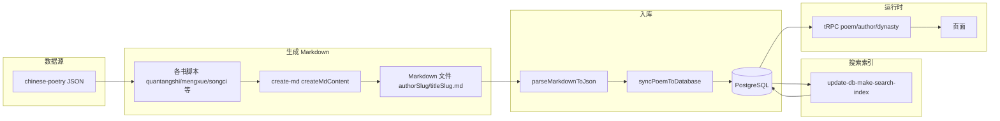

# 老项目（AsPoem）技术参考

本文档从**开发视角**梳理老项目（aspoem）的数据流、脚本职责、DB 设计、API、Markdown 解析、Slug/拼音/searchText 规则及组件与路由对应，供新系统（poetry）开发时对照与复刻。访客使用说明见 [legacy-usage-guide.md](legacy-usage-guide.md)，功能点清单见 [phase1-features-and-extensions.md](phase1-features-and-extensions.md)。

## 一、概述

- **技术栈**：Next.js 16、React 19、Prisma、PostgreSQL、tRPC、better-auth、Tailwind、shadcn/ui。
- **入口与运行**：`next dev -p3333`，根路径 `/` 重定向至 `/poems`。
- **数据来源与构建**：chinese-poetry 仓库 JSON 经 `scripts/chinese-poetry-to-markdown` 各书脚本生成 Markdown（`createMdContent`），再经 `scripts/poems-to-db`（`parseMarkdownToJson` + `syncPoemToDatabase`）入库；搜索索引由 `scripts/update-db-make-search-index.ts` 生成 `searchText`。

## 二、目录与入口

| 目录/文件 | 职责 |
|-----------|------|
| `src/app/(main)/` | 前台路由：`page.tsx`（重定向）、`poems/`（列表/详情/热门/随机/按朝代）、`authors/`（列表/详情/按朝代）、`quotes/`、`ai-generator/`、`games/`（占位） |
| `src/app/api/` | API 路由：auth、tRPC、webhook |
| `src/components/` | 公共组件：header（含 cmdk 搜索）、poem-typography（正文/工整对仗）、ui（shadcn） |
| `src/lib/` | 工具与解析：ast-markdown（Markdown→PoemData）、sync-poem-to-db（PoemData→DB）、utils、parsers |
| `src/server/api/` | tRPC 路由：root、poem、poem/discover、author、dynasty、auth、protected、webhook |
| `scripts/chinese-poetry-to-markdown/` | 各书脚本调用 create-md 生成 Markdown |
| `scripts/poems-to-db/` | 递归读 poems 目录 .md，解析后同步到 PostgreSQL |
| `scripts/update-db-make-search-index.ts` | 为 poems 表填充 searchText（无声调拼音+标题/作者/朝代） |
| `scripts/format-db/` | 朝代同步、迁移等 |
| `prisma/schema.prisma` | 数据模型：Poem、Author、Dynasty、Tag |

## 三、数据流

- **构建链路**：chinese-poetry JSON → 各书脚本（如 quantangshi、mengxue/tangshisanbaishou）→ `createMdContent` 写出 `authorSlug/titleSlug.md` → `poems-to-db` 递归读 .md → `parseMarkdownToJson` → `syncPoemToDatabase` 写入/更新 Poem、Author、Dynasty、Tag → 可选执行 `update-db-make-search-index` 更新 `poems.searchText`。
- **运行时**：页面通过 tRPC 查询 poem、poemDiscover、author、dynasty；搜索使用 `poem.search`，按 `searchText` 包含关键词查询。

## 四、脚本与职责

### 4.1 gen:markdown 对应脚本（chinese-poetry-to-markdown）

| 脚本文件 | 数据源 | 说明 |
|----------|--------|------|
| `quantangshi.ts` | 全唐诗/*.json | 数组项 title/author/paragraphs，朝代由文件名推断（tang/song） |
| `yudingquantangshi.ts` | 御定全唐诗 | dynasty: 唐 |
| `songci.ts` | 宋词 | dynasty: 宋 |
| `shuimotangshi.ts` | 水墨唐诗 | dynasty: 唐，tags: 水墨唐诗 |
| `wudaishici.ts` | 五代十国 | dynasty: 五代，tags: 花间集 等 |
| `nalanxingde.ts` | 纳兰性德 | dynasty: 清 |
| `yuanqu.ts` | 元曲 | dynasty: 元 |
| `lunyu.ts` | 论语 | dynasty: 春秋，tags: 蒙学 |
| `caocao.ts` | 曹操 | dynasty: 东汉末年 |
| `chuci.ts` | 楚辞 | 作者-朝代映射表 |
| `mengxue/guwenguanzhi.ts` | 蒙学/古文观止 | 解析 section.content，dynasty 从 author 字符串「先秦：左丘明」等解析，tags: section.title, 古文观止, 蒙学 |
| `mengxue/tangshisanbaishou.ts` | 蒙学/唐诗三百首 | dynasty: 唐，tags: 蒙学, 唐詩三百首, item.type |
| `mengxue/shenglvqimeng.ts` | 声律启蒙 | dynasty: 清 |
| `mengxue/sanzijin.ts`、`sanzijin-new.ts` | 三字经 | dynasty: 南宋到清末，tags: 蒙学 |
| `mengxue/qianziwen.ts` | 千字文 | dynasty: 南北，tags: 蒙学 |
| `mengxue/qianjiashi.ts` | 千家诗 | dynasty 从作者括号「（唐）令狐楚」解析，tags: section.type, 千家诗, 蒙学 |
| `mengxue/dizigui.ts`、`baijiaxing.ts`、`zhuzijiaxun.ts` | 弟子规/百家姓/朱子家训 | 蒙学，tags: 蒙学 等 |

入口：`chinese-poetry-to-markdown/index.ts` 中按需调用上述 sync 函数；输出目录由 create-md 内 `POEMS_DIR` 指定（如 `../aspoem-backup/poems`）。各源 JSON 结构详见 [chinese-poetry-data-formats.md](chinese-poetry-data-formats.md)。

### 4.2 create-md 约定（create-md/index.ts）

- **路径**：`<POEMS_DIR>/poems/<authorSlug>/<titleSlug>.md`。
- **Frontmatter**：id（= authorSlug-titleSlug）、title、titlePinyin、titleSlug、author、authorPinyin、authorSlug、dynasty、dynastyPinyin、dynastySlug、tags（JSON 数组）。
- **区块顺序**：`## 正文`（列表 `- 句子`）、`## 拼音`（列表）、`## 注释`、`## 译文`、`## 赏析`。
- **拼音**：pinyin-pro `toneType: "num"` 带声调数字；slug 用 `toneType: "none"` 无声调。

### 4.3 poems-to-db（Markdown→DB）

- **入口**：`scripts/poems-to-db/index.ts`，递归读取 `poemsDir` 下所有 `.md`。
- **流程**：每文件 `readFileSync` → `parseMarkdownToJson(markdownContent)`（见 ast-markdown）→ `syncPoemToDatabase(poemData)`。
- **syncPoemToDatabase**（sync-poem-to-db.ts）：按 dynastySlug 创建/查找 Dynasty，按 authorSlug 创建/更新 Author（绑定 dynastyId），按 tags 创建/关联 Tag，Poem 以 `poemData.id` 为 slug 做 upsert。

### 4.4 update-db-make-search-index

- **职责**：为 poems 表填充/更新 `searchText` 字段。
- **规则**：见下「searchText 规则」一节。

## 五、DB 设计（Prisma）

| 表 | 关键字段 | 说明 |
|----|----------|------|
| **poems** | id, slug（唯一，= frontmatter id），title, titleSlug, titlePinyin, paragraphs[], paragraphsPinyin[], annotation(Json?), translation, appreciation, isOrderliness, searchText, authorId, dynastyId?, tags 多对多, visits, createdAt, updatedAt | slug 即 authorSlug-titleSlug |
| **authors** | id, name, pinyin, slug（唯一）, dynastyId, birthDate?, deathDate?, introduce?, epithets[], style?, visits, createdAt, updatedAt | |
| **dynasties** | id, name, pinyin, slug（唯一）, createdAt, updatedAt | |
| **tags** | id, name, slug（唯一）, poems 多对多, visits, createdAt, updatedAt | |

与 poetry 新系统（纯静态）的对应：poetry 无 SQLite，数据为构建时生成的 JSON（如 `data/poems.json`）与预渲染 HTML；数据模型（Poem、Author、Dynasty、Tag 等）在构建时以 dataclass 形式存在，字段命名 snake_case，逻辑等价。搜索参考 Hexo（构建时生成索引 JSON + 前端过滤），分页参考 Hexo hexo-pagination（构建时多页静态 HTML）。见 [tech-overview.md](tech-overview.md) 与 poetry `data/models.py`。

## 六、API 设计（tRPC）

| 路由 | Procedure | 入参 | 出参/说明 |
|------|-----------|------|-----------|
| **poem.findDetail** | query | id? 或 slug?（二选一） | 单首 Poem（含 author、dynasty、tags），访问量 +1 |
| **poem.search** | query | keyword: string | poems 列表（最多 20），where searchText contains keyword |
| **poem.getHotList** | query | limit, cursor? | 按 visits 降序，游标分页 |
| **poem.getLatestList** | query | limit, cursor? | 按 updatedAt 降序，游标分页 |
| **poem.getLatestListByDynasty** | query | dynastySlug, limit, cursor? | 该朝代诗词，游标分页，带 dynasty 信息 |
| **poem.getRandom** | query | — | 随机一首（skip randomOffset） |
| **author.getList** | query | dynastySlug?, limit, cursor? | 作者列表，可选按朝代，游标分页 |
| **author.getPagedList** | query | dynastySlug?, pageSize, page | 作者列表，页码分页 |
| **author.findBySlug** | query | slug | 作者详情（含 dynasty、诗词数等） |
| **dynasty.getPoemsCount** | query | — | 各朝代及诗词数量 |
| **dynasty.getAuthorsCount** | query | — | 各朝代及作者数量 |

根路由：`server/api/root.ts` 聚合 auth、poem（含 discover）、author、dynasty、webhook、protectedPoem、protectedDynasty。

## 七、Markdown 解析（ast-markdown）

- **入口**：`parseMarkdownToJson(markdownContent)`，使用 `gray-matter` 解析 frontmatter，`unified`+`remark-parse`+`remark-gfm` 解析正文 AST。
- **Frontmatter 映射**：id, title, titlePinyin（经 convertPinyin 格式化）, titleSlug, author, authorPinyin, authorSlug, dynasty, dynastyPinyin, dynastySlug, tags（数组或逗号分隔转数组）。
- **Section 名称与处理**：
  - `正文`：列表项 → result.paragraphs（字符串数组）。
  - `拼音`：列表项 → result.paragraphsPinyin（经 pinyin-pro convert）。
  - `注释`：段落/列表 → 按行拆「词：释义」→ result.annotation（键值对对象）。
  - `译文`：段落 → result.translation（join \n）。
  - `赏析`：段落 → result.appreciation（join \n）。
- **与 poetry 的对应**：poetry [markdown-format.md](markdown-format.md) 约定路径 `author_slug/titleSlug.md`、frontmatter 字段及区块名（正文、拼音、注释、译文、赏析）与老项目 create-md 一致；poetry load_data._parse_sections 按 `## 标题` 与列表/段落解析，逻辑与 ast-markdown 兼容，顺序不限、缺失区块按空处理。

## 八、Slug 与拼音

- **老项目 genSlug**（create-md）：`slugify(pinyin(text, { toneType: "none" }).replace(/\s+/g, "-").toLowerCase())`，即**无声调拼音 + 连字符**，小写。
- **id**：`authorSlug + "-" + titleSlug`（作者在前）。
- **文件路径**：`<POEMS_DIR>/poems/<authorSlug>/<titleSlug>.md`。
- **拼音展示**：pinyin-pro `toneType: "num"`（带声调数字），用于 titlePinyin、authorPinyin、dynastyPinyin 及 `## 拼音` 区块。
- **与 poetry 的对应**：poetry 新系统 load_data（Node/TS）使用 pinyin-pro 或 pinyin 等库得到无声调拼音 + "-".join + slugify，与 genSlug 等价；id 与路径约定一致（author_slug/titleSlug.md），见 [markdown-format.md](markdown-format.md)。

## 九、searchText 规则

- **脚本**：`scripts/update-db-make-search-index.ts`。
- **拼接顺序**（空格连接）：作者名、作者拼音（无声调）、朝代名、朝代拼音（无声调）、标题、标题拼音（无声调）。当前实现中正文/正文拼音未纳入。
- **无声调转换**：pinyin-pro `convert(text, { format: "toneNone" })`。
- **写入**：`poem.update({ data: { searchText: searchText.replace(/\s+/g, " ").trim() } })`。
- **查询**：`poem.search` 使用 `where: { searchText: { contains: keyword } }`。
- **与 poetry 的对应**：poetry 构建时写出的搜索索引（如 `data/poems.json`）中可包含与 searchText 等价的字段（标题、作者、朝代及无声调拼音等），供前端过滤；见 [tech-overview.md](tech-overview.md)「搜索方案」。

## 十、组件与路由

| 路由 | 页面/布局 | 关键组件 | 说明 |
|------|------------|----------|------|
| `/` | (main)/page.tsx | — | 重定向到 /poems |
| `/poems` | poems/(list)/page.tsx | sidebar-left（发现/朝代）、poem-list-item、poem-load-more | 默认最近更新，游标加载更多 |
| `/poems/hot` | poems/(list)/hot/page.tsx | 同上 | 最受欢迎（visits 降序） |
| `/poems/random` | poems/(list)/random/page.tsx | — | 随机一首，可再随机 |
| `/poems/dynasty/[slug]` | poems/(list)/dynasty/[slug]/page.tsx | 同上 | 按朝代诗词列表 |
| `/poems/detail/[slug]` | poems/detail/[slug]/page.tsx | poem-typography（正文/工整对仗）、sidebar-right（read-setting、author-card、feedback） | 详情页；read-setting：简体/繁体、楷体/宋体、拼音标注、原文注解 |
| `/authors` | authors/page.tsx | author-table、sidebar-left | 作者列表，支持按朝代、分页 |
| `/authors/detail/[slug]` | authors/detail/[slug]/page.tsx | — | 作者详情及名下诗词 |
| `/authors/dynasty/[slug]` | authors/dynasty/[slug]/page.tsx | — | 按朝代作者列表 |
| 全局 | header | cmdk（搜索）、menu、Logo | 搜索 ⌘K/Ctrl+K，打开命令框 |

- **阅读设置**：read-setting.tsx 与 stores/poem-typography.ts 控制字体（楷体/宋体）、拼音显隐、原文注解显隐、简繁（若实现）。
- **工整对仗**：poem-typography 下 orderliness 子组件根据 isOrderliness 渲染固定版式（如 ruby、两行结构）。

---

*老项目技术参考完。新系统实现时以 [tech-overview.md](tech-overview.md) 与 [markdown-format.md](markdown-format.md) 为准，本文档仅作对照与复刻参考。*
